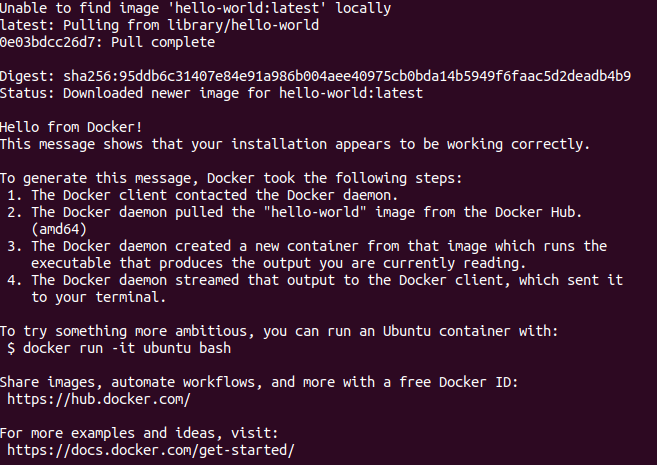

# What is Docker

Docker lets you package and run any application in an isolated environment called a container. So, you make a Docker image of your dev enviourment ,push the image on [DockerHub](https://hub.docker.com/). Then , on the production enviourment , you just pull the dockerfile from DockerHub and run the file. You can easily deploy your application from dev enviourmnet to production enviourment this easily.

# Installing Docker engine on your machine

## Installing on your linux machine

First update your apt package index
```bash
sudo apt-get update
```
The install the latest version of Docker engine     

```bash
sudo apt-get install docker-ce docker-ce-cli containerd.io -y
```
Now, check if everything's working fine 
```bash
sudo docker run hello-world
```
You can see this output



# Docker image and container 

Docker image and docker container is not the same. What we pull or push from DOckerHub is image. Image can exist without any container. But when you run any docker image with/without some configuration, it becomes a docker container. Container contains docker image and some configuaration.

You can see the docker images stored on your machine by running this command.
```bash
sudo docker images #either this command
sudo docker image ls #or this command
```
You can see the running docker containers by running this command
```bash
# either these commands
sudo docker ps #to show just current running containers
sudo docker ps -a # to show all running and stopped containers
# or these commands
sudo docker container ls #to show just current running containers
sudo docker container ls -a # to show all running and stopped containers
```
You can see that, every container has its own unique container id and conatiner name. By default the id and name are auto-generated. But you can set the name of the container while starting a new container using the `--name` tag.
```bash
# start a container from hello-world image with a name
sudo docker run --name my-docker hello-world
# now check the names of your container from the output of this command
sudo docker ps -a
```
Now, you can see that, the name of the last conatiner is **my-docker**

# Useful links

* [The Docker Handbook](https://docker.farhan.info/) & [project links](https://github.com/fhsinchy/docker-handbook-projects) for this book.
* [Docker tutorial](https://youtu.be/3c-iBn73dDE)