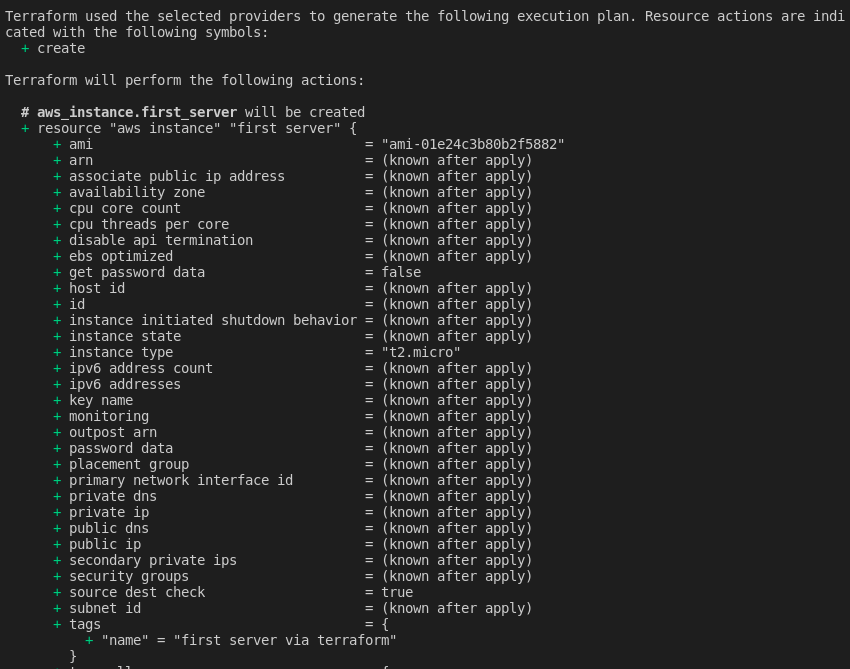
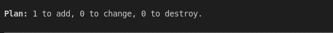
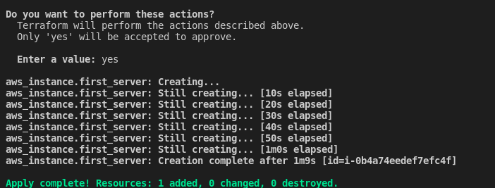
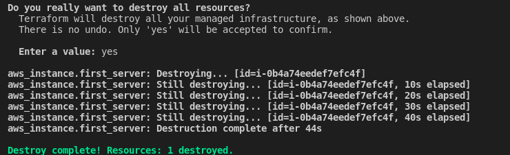

# Introduction to Terraform
Terraform is an infrastructure as code (IaC) tool for creating, changing, and destroying infrastructure. It is an open-source project started and maintained by Hashicorp and is similar to `Chef` and `Ansible`.

## What can Terraform do for us?
* Terraform can help us create a cloud environment and configure it.
* Terraform can help us register our instances in a cloud environment like AWS, Azure, etc.
* Terraform can help us destroy cloud environments.     
### To see more about Terraform, please visit [Terraform website](https://www.terraform.io/).

## Installation
### Windows
* Download the latest version of Terraform for Windows from [Terraform website](https://www.terraform.io/downloads.html).
* Unzip the downloaded file and put it in another directory and copy the folder `path`
* Now, add the path of the folder `path` to the system environment variable `PATH`
### Linux
* Download the latest version of Terraform for Linux from [Terraform website](https://www.terraform.io/downloads.html).
* Extract the downloaded file and put it in `/usr/local/bin`
  ```bash
  sudo mv terraform /usr/local/bin/terraform
  ```
Now you can run `terraform` command from the terminal.  
### Now you can run this command from terminal/cmd to check if Terraform is installed successfully.
```bash
terraform --version
```
You can see the version of Terraform as `Terraform v1.0.3`.

# Creating an ec2 instance using terraform

## Authentication
 **option 1**   
 Hard code the AWS credentials in the terraform file/ static credentials
 ```terraform
provider "aws" {
  region     = REGION_NAME
  access_key = YOUR_ACCESS_KEY
  secret_key = YOUR_SECRET_KEY
}
 ```

**option 2**    
Set the following environment variables:
```bash
export AWS_REGION=REGION_NAME
export AWS_ACCESS_KEY_ID=YOUR_ACCESS_KEY
export AWS_SECRET_ACCESS_KEY=YOUR_SECRET_KEY
```
In the terraform file,
```terraform
provider "aws" {}
```
**option 3**    

Shared credentials file
You can use an AWS credentials file to authenticate terrform to AWS. The default location is `$HOME/.aws/credentials`.
```terraform
provider "aws" {
  region                  = REGION_NAME
  shared_credentials_file = "~/.aws/credentials"
  profile                 = PROFILE_NAME
}
```
## Adding any resource

To add any resource, the syntax is:
```terraform
resource "PROVIDER_RESOURCE-TYPE" "NAME" {
    configs ...
}
```
So, if we want to create a ec2 instance, the syntax is:

```terraform
resource "aws_instance" "web" {
    ami             = AMI_ID
    instance_type   = "t2.micro"
    tags            = { 
        Name = "MyEC2Instance" 
    }
}
```
You can find the AMI_ID in the AWS console. 
## Running terraform 
At first, go to the `terraform` directory.
Now run the following command:
```bash
terraform init
```
This command will initialize provider plugins and downloading the
required modules. You can see a `.terraform` directory in the
current directory.

Now run the following command:
```bash
terraform plan
```
This command will show you the resources that will be created. 
If you run this command for [this](basics/main.tf) example, you will see a long output starting like this
    
Last line of the output  
      
 Now, to apply the changes, run the following command:
 ``` terraform
terraform apply
 ```
 This will create an ec2-instance. The output will be like this:
  

Now you can see the ec2-instance in the AWS console.

 To destroy the instance, run the following command:
 ```terraform
terraform destroy
```
You'll see the changes and this output:
      
In your AWS console, you can see that your instance status is terminated.
## Useful links

### [Terraform docs](https://www.terraform.io/docs/index.html)   
### [AWS terraform docs](https://registry.terraform.io/providers/hashicorp/aws/latest/doc)  
