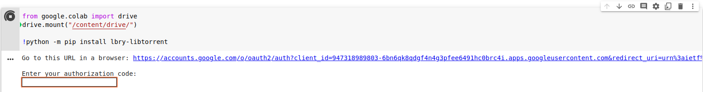
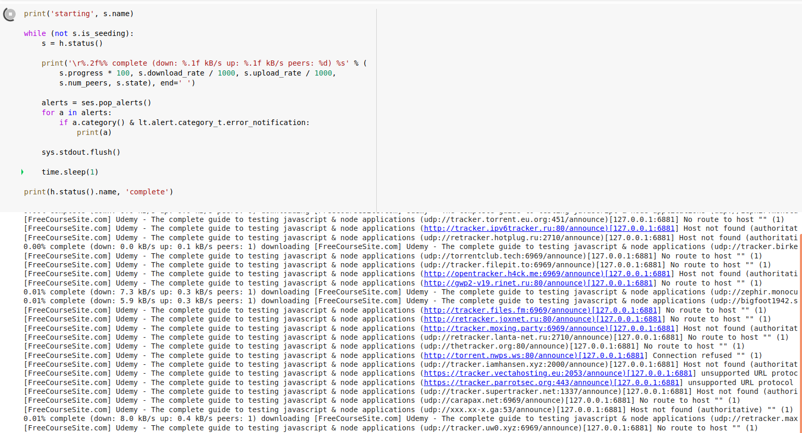

## To use this direct to your google-colab 


[](https://colab.research.google.com/github/nayeem-17/Random-writeups/blob/master/torrent-to-drive/Torrenttodrive.ipynb)

After opening the file in google-colab, it's safe to save a copy in your google drive then modify it. Change the `path` in the file. Here's the default path
```python
path="/content/drive/MyDrive/Torrent"
```
If you don't change the path, you'll find the file in this path after downloading.

After changing the path, 
- if you want to download from magnet link, then comment these lines of code 
  ```python
    source = files.upload()
    params = {
            "save_path": path,
        "ti": lt.torrent_info(list(source.keys())[0]),
    }
    h=ses.add_torrent(params)
    s=h.status()
    ```
    and uncomment these lines,
    ```python
    # print("Enter the magnet link")
    # magnet_link = input()
    # h = lt.add_magnet_uri(ses, link, {'save_path': path})
    # s = h.status()
    ```
Now, run all cells at once, (`ctrl+f9`)     
- You have to authorize your account. Click the link, select your account and copy the code, and paste 

- Upload the torrent file/ valid magnet link
- Now, just wait


### If the files are too big or for some reason the execution failed. Then just run all cells at once again. This time you don't have to authorize your Google account. T_T